# SELECT Queries

**SELECT Queries**  
– Think Like a Frontend API Imagine the following queries are API endpoints the
frontend will call:

**• GET /loans/overdue → List all overdue loans with member name, book title, due date**

```sql
SELECT M.FName +' '+ M.LName AS 'FULL NAME' , B.Title AS 'BOOK TITLE' , L.Status AS 'LOAN STATUS' FROM Members M
INNER JOIN Loan L ON M.M_ID = L.M_ID
INNER JOIN Book B ON B.Book_ID = L.Book_ID WHERE L.Status ='Overdue'
```


**• GET /books/unavailable → List books not available**
```sql
SELECT * FROM Book WHERE Available_State = 'False'
```

**• GET /members/top-borrowers → Members who borrowed >2 books**
```sql
SELECT M.FName + ' ' + M.LName AS 'MEMEBER NAME', COUNT (B.M_ID) AS 'TOTAL BORROWED' FROM Members M 
INNER JOIN Book B ON M.M_ID = B.M_ID
GROUP BY M.FName,M.LName, M.M_ID
HAVING COUNT (B.M_ID)  > 2;
```
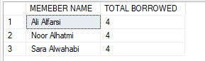

**• GET /books/:id/ratings → Show average rating per book**
```sql
SELECT Book_ID AS 'BOOK ID' , AVG(Rating) AS 'AVERAGE RATING' FROM ReviewBook 
GROUP BY Book_ID

```
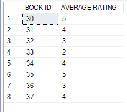
**• GET /libraries/:id/genres → Count books by genre**
```sql
SELECT Genre, COUNT(*) AS 'GENRE COUNT'
FROM Book 
GROUP BY Genre;
```
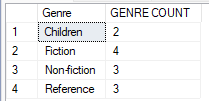

**• GET /members/inactive → List members with no loans**
```sql
SELECT * 
FROM Members 
WHERE M_ID NOT IN (SELECT DISTINCT M_ID FROM Loan);
```
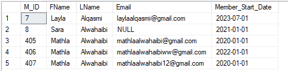

**• GET /payments/summary → Total fine paid per member**
```sql
SELECT M.FName + ' ' + M.LName AS 'MEMBER NAME', SUM(P.Amount) AS 'TOTAL FINE'
FROM Payment P
JOIN Members M ON P.M_ID = M.M_ID
GROUP BY M.FName, M.LName;
```

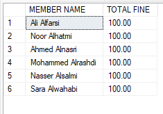


**• GET /reviews → Reviews with member and book info**
```sql
 SELECT  M.FName +' '+M.LName AS 'MEMBER NAME' ,B.* ,RB.Rating AS 'RATING', RB.Comments AS 'COMMENTS',RB.Review_Date AS 'REVIEW DATE' FROM ReviewBook RB 
 INNER JOIN Book B ON B.Book_ID = RB.Book_ID 
 INNER JOIN Members M ON M.M_ID = B.M_ID
```


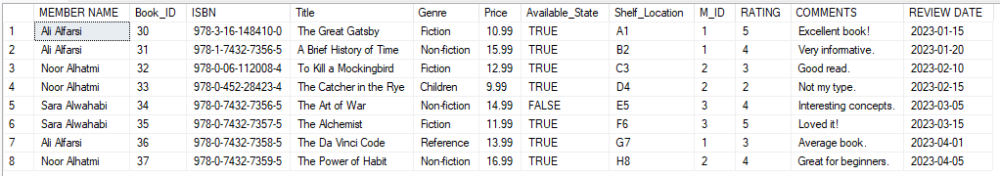

**• GET /books/popular → List top 3 books by number of times they were loaned**
```sql
SELECT TOP 3 B.Title, COUNT(*) AS Loan_Count
FROM Loan L
JOIN Book B ON L.Book_ID = B.Book_ID
GROUP BY B.Title
ORDER BY Loan_Count DESC;

```

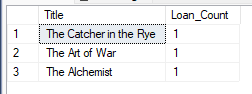

**• GET /members/:id/history → Retrieve full loan history of a specific member including book title,loan & return dates**
```sql
SELECT M.* , B.Title AS 'BOOK TITLE' , L.Loan_Date AS 'LONE DATE' ,L.Return_Date AS 'RETURN DATE' FROM Members M 
INNER JOIN Loan L ON M.M_ID = L.M_ID
INNER JOIN Book B ON B.Book_ID = L.Book_ID
```

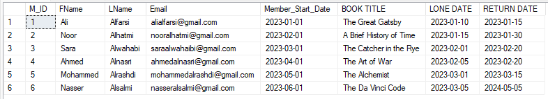

**• GET /books/:id/reviews → Show all reviews for a book with member name and comments**
```sql
SELECT  RB .* ,M.FName +' '+M.LName AS 'MEMBER NAME' FROM ReviewBook RB
LEFT JOIN Members M ON M.M_ID = RB.M_ID 
```


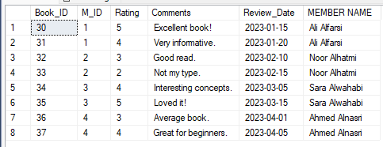

**• GET /libraries/:id/staff → List all staff working in a given library**
```sql
SELECT S.* , l.L_Name AS 'LIBRARY NAME' FROM Staff S INNER JOIN Library L ON L.L_ID = S.L_ID
```

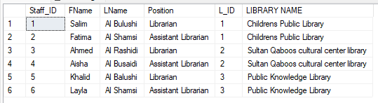


**• GET /books/price-range?min=5&max=15 → Show books whose prices fall within a given range**
```sql
SELECT * FROM Book WHERE Price BETWEEN 5 AND 15
```


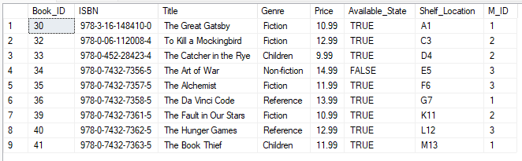


**• GET /loans/active → List all currently active loans (not yet returned) with member and book info**
```sql
SELECT L.* , B.* , M.FName +' '+M.LName AS 'MEMBER NAME' FROM Members M 
INNER JOIN Loan L ON M.M_ID = L.M_ID 
INNER JOIN Book B ON B.Book_ID = L.Book_ID
WHERE L.Status='Issued'
```


**• GET /members/with-fines → List members who have paid any fine**
```sql
SELECT M.* , P.Amount FROM Members M
INNER JOIN Payment P ON M.M_ID = P.M_ID
```


**• GET /books/never-reviewed → List books that have never been reviewed**
```sql
SELECT * 
FROM Book 
WHERE Book_ID NOT IN (SELECT DISTINCT Book_ID FROM ReviewBook);
```

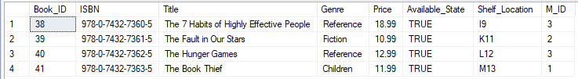


**• GET /members/:id/loan-history →Show a member’s loan history with book titles and loan status.**
```sql
SELECT L.* ,B.Title AS 'BOOK TITLE', L.Status  FROM Loan L 
INNER JOIN Book B ON B.Book_ID=L.Book_ID
```
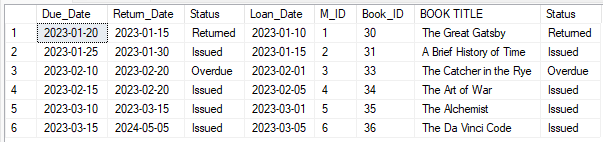


**• GET /members/inactive →List all members who have never borrowed any book.**
```sql

```
**• GET /books/never-loaned → List books that were never loaned.**
```sql

```
**• GET /payments →List all payments with member name and book title.**
```sql

```
**• GET /loans/overdue→ List all overdue loans with member and book details.**
```sql

```
**• GET /books/:id/loan-count → Show how many times a book has been loaned.**
```sql

```
**• GET /members/:id/fines → Get total fines paid by a member across all loans.**
```sql

```
**• GET /libraries/:id/book-stats → Show count of available and unavailable books in a library.**
```sql

```
**• GET /reviews/top-rated → Return books with more than 5 reviews and average rating > 4.5.**
```sql

```